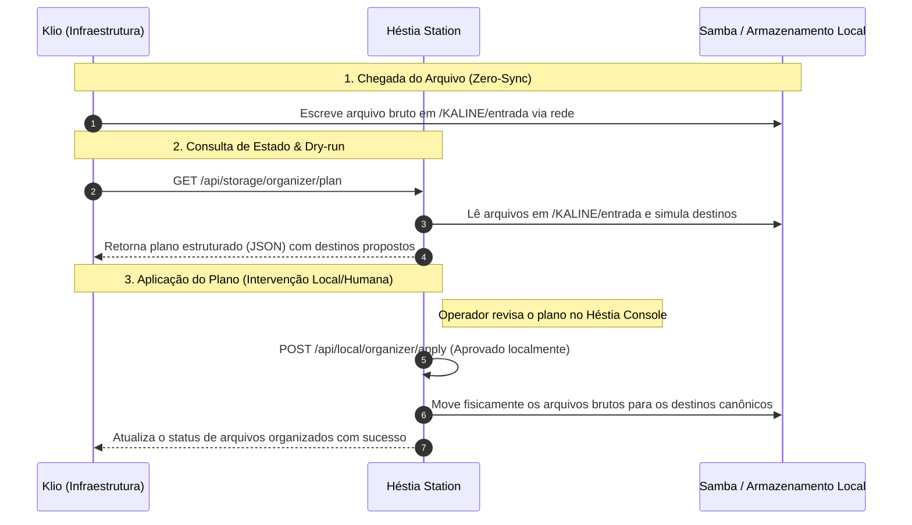

# Contrato de Integração — Héstia & Klio (HESTIA_KLIO_CONTRACT)

Este documento define a especificação técnica e de arquitetura para a integração entre o sistema **Héstia** e a infraestrutura **Klio**, substituindo o uso de ferramentas de sincronização ativas externas (ex: Syncthing) por conexões de rede seguras e transporte via pastas locais/compartilhadas.

---

## 1. Premissas de Infraestrutura

### 1.1 Conectividade de Rede: Tailscale
- **Tailscale** conecta a rede privada virtual de forma segura.
- A instância da **Héstia** expõe o console visual e as APIs REST no IP privado Tailscale do servidor na porta canônica `4517` (ex: `http://100.x.y.z:4517`).
- A **Klio** consome as APIs de diagnóstico e planejamento consultando a Héstia diretamente por este IP privado Tailscale.

### 1.2 Camada de Transporte: Pasta Compartilhada (Samba)
- Não há ferramenta de sincronização ativa automática (Syncthing) rodando no plano de fundo para mover arquivos.
- A Héstia opera de forma **local/compartilhada**:
  - Os arquivos brutos de entrada chegam ou por montagens locais (discos físicos anexados em `/KALINE`) ou através de compartilhamento de rede local/Samba (`smbd` / `samba`).
  - A pasta compartilhada `/KALINE` é o meio pelo qual novos arquivos são transportados para a estação.
  - A Héstia processa os arquivos de `/KALINE/entrada` movendo-os para seus respectivos destinos finais (`/KALINE/midia`, `/KALINE/codice`, etc.) localmente e de forma transacional através do plano de organização aprovado.

---

## 2. A Caixa Hermes Box

A **Caixa Hermes** (localizada em `config.hermesRoot` ou `/KALINE/HESTIA`) é descrita como uma pasta local/compartilhada comum (sem presunção de sincronização por Syncthing):
- **Inbox** (`/KALINE/HESTIA/inbox`): Local onde comandos persistentes estruturados em formato `.json` são colocados para processamento da Héstia.
- **Outbox** (`/KALINE/HESTIA/outbox`): Local onde a Héstia escreve o resultado do processamento na forma de arquivos `*.result.json`.
- **Funcionamento**: Qualquer agente local, script de automação ou montagem de rede (via Samba/Tailscale) pode escrever na Inbox. O daemon interno do Hermes vigia essa pasta e processa os comandos localmente.

---

## 3. Contrato de Endpoints /api (Klio Consumption)

### 3.1 Endpoints Prontos para Consumo da Klio (Leitura & Planejamento)
Estes endpoints são seguros, informativos, idempotentes e podem ser consultados livremente pela Klio como infraestrutura:

| Método | Endpoint | Descrição |
| :--- | :--- | :--- |
| `GET` | `/api/health` | Verifica a saúde operacional e versão da estação. |
| `GET` | `/api/server/status` | Retorna informações de hardware do sistema operacional (CPU, memória, uptime). |
| `GET` | `/api/storage/status` | Retorna o status de montagem e utilização de disco nos caminhos mapeados. |
| `GET` | `/api/storage/model` | Retorna o modelo canônico estrutural de pastas em `/KALINE`. |
| `GET` | `/api/services/status` | Retorna o status operacional dos serviços monitorados (Samba, Tailscale, Jellyfin). |
| `GET` | `/api/storage/scan` | Retorna o scan de arquivos reais de `/KALINE` e de fontes externas. |
| `GET` | `/api/storage/organizer/plan` | Gera e simula em modo dry-run um plano de organização dos arquivos recebidos. |

### 3.2 Endpoints Sensíveis (Excluídos da Automação da Klio)
Estes endpoints realizam mutações no disco do servidor, alteram configurações de segurança ou expõem logs internos detalhados. Eles **devem ficar de fora** da automação externa automática da Klio, exigindo sempre ação deliberada do console visual Héstia ou do operador local:

| Método | Endpoint | Racional da Exclusão |
| :--- | :--- | :--- |
| `POST` | `/api/local/organizer/apply` | Executa a movimentação física dos arquivos no HD. Risco de interrupção ou bloqueio se invocado por automação não supervisionada. |
| `POST` | `/api/local/organizer/runs/:runId/undo` | Reverte operações físicas no disco (Desfazer). Apenas para o operador humano em caso de erro. |
| `POST` | `/api/local/organizer/runs/:undoRunId/redo` | Reaplica operações desfeitas (Refazer). Apenas para o operador humano. |
| `GET` | `/api/logs` | Contém logs detalhados e sensíveis da máquina e processos. |
| `GET` | `/api/config` | Expõe caminhos e segredos de ambiente internos da Héstia. |

---

## 4. Fluxo de Trabalho de Organização Local

