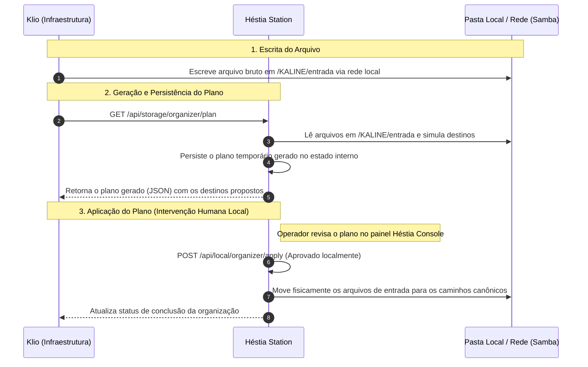

# Contrato de Integração — Héstia & Klio (HESTIA_KLIO_CONTRACT)

Este documento define a especificação técnica e de arquitetura para a integração segura entre o sistema **Héstia** e a infraestrutura **Klio**, utilizando conexões de rede locais ou privadas e transporte via pastas locais/compartilhadas, sem depender de ferramentas de sincronização ativa.

---

## 1. Premissas de Infraestrutura

### 1.1 Conectividade de Rede: Local e Acesso Remoto Privado (Tailscale)

- **Héstia** roda e escuta localmente por padrão no endereço de loopback `127.0.0.1` na porta canônica `4517` (ex: `http://127.0.0.1:4517`).
- O acesso de rede a partir de outros hosts (incluindo endereços IP privados atribuídos por VPNs como **Tailscale** ou redes LAN) exige duas condições explícitas configuradas na instância da Héstia:
  1. A escuta do host deve estar configurada para um IP não-loopback (como `0.0.0.0` ou o IP privado específico da interface de rede).
  2. A variável de ambiente `HESTIA_ALLOW_LAN=1` deve estar definida para liberar o tráfego externo/LAN no servidor.
- Uma vez satisfeitas as regras acima, a **Klio** consome as APIs de diagnóstico e planejamento autorizadas consultando a Héstia diretamente pelo endereço IP privado.

### 1.2 Camada de Transporte: Pasta Local/Compartilhada

- Não há ferramenta de sincronização ativa automática rodando de forma contínua em segundo plano.
- A Héstia opera com base em **armazenamento local/compartilhado**:
  - Os arquivos brutos de entrada chegam por montagens locais (como discos físicos anexados sob a pasta raiz `/KALINE`) ou através de compartilhamento de rede local/Samba (`smbd` / `samba`).
  - A pasta de entrada `/KALINE/entrada` serve de transporte para a recepção dos arquivos brutos.
  - A Héstia processa os arquivos de `/KALINE/entrada` movendo-os para seus destinos canônicos (`/KALINE/midia`, `/KALINE/codice`, etc.) localmente e de forma transacional através do plano de organização aprovado pelo operador.

---

## 2. A Caixa Hermes Box

A **Caixa Hermes** (localizada sob a pasta raiz de monitoramento em `/KALINE/HESTIA`) é descrita como um conjunto de pastas locais sem vigilância contínua ou watchers automáticos em segundo plano.

### 2.1 Estrutura

- **Inbox** (`/KALINE/HESTIA/inbox`): Local onde comandos persistentes estruturados no formato `.json` são colocados.
- **Outbox** (`/KALINE/HESTIA/outbox`): Local onde a Héstia escreve o resultado do processamento na forma de arquivos `*.result.json`.

### 2.2 Mecanismo de Execução Manual (Process-Once)

- A Héstia **não** possui um daemon ou watcher contínuo monitorando o diretório Hermes.
- O processamento dos comandos colocados na Inbox é **manual e sob demanda**, devendo ser explicitamente engatilhado por uma chamada HTTP externa.
- A execução do lote de comandos é acionada por uma requisição do endpoint `/api/hermes/process-once`.
- **Segurança Obrigatória**: Por se tratar de uma operação local de modificação e execução de comandos, a chamada ao endpoint `/api/hermes/process-once` **exige obrigatoriamente** o envio do cabeçalho HTTP:
  ```http
  X-Hestia-Local-Confirm: hermes
  ```

---

## 3. Contrato de Endpoints /api (Klio Consumption)

### 3.1 Endpoints Prontos para Consumo e Planejamento

Estes endpoints expõem informações estruturais da estação e podem ser consumidos de forma segura pela Klio:

| Método | Endpoint                      | Tipo                       | Descrição                                                                                                                                                                                           |
| :----- | :---------------------------- | :------------------------- | :-------------------------------------------------------------------------------------------------------------------------------------------------------------------------------------------------- |
| `GET`  | `/api/health`                 | Leitura                    | Verifica a saúde operacional e versão da estação.                                                                                                                                                   |
| `GET`  | `/api/server/status`          | Leitura                    | Retorna informações de hardware do sistema operacional (CPU, memória, uptime).                                                                                                                      |
| `GET`  | `/api/storage/status`         | Leitura                    | Retorna o status de montagem e utilização de disco nos caminhos mapeados.                                                                                                                           |
| `GET`  | `/api/storage/model`          | Leitura                    | Retorna o modelo canônico estrutural de pastas em `/KALINE`.                                                                                                                                        |
| `GET`  | `/api/services/status`        | Leitura                    | Retorna o status operacional dos serviços monitorados (Samba, Tailscale, Jellyfin).                                                                                                                 |
| `GET`  | `/api/storage/scan`           | Leitura                    | Retorna o scan de arquivos reais de `/KALINE` e de fontes externas.                                                                                                                                 |
| `GET`  | `/api/storage/organizer/plan` | Escrita/Dry-Run Persistido | Gera e simula em modo dry-run um plano de organização dos arquivos. Este endpoint **não é de leitura pura**, pois escreve e persiste o plano temporário gerado no estado de histórico da aplicação. |

### 3.2 Endpoints Sanitizados e Limitados

Estes endpoints expõem informações que necessitam de cuidados de exposição ou limitação de tamanho para segurança:

| Método | Endpoint             | Tipo                    | Descrição                                                                                                        |
| :----- | :------------------- | :---------------------- | :--------------------------------------------------------------------------------------------------------------- |
| `GET`  | `/api/config`        | Configuração Sanitizada | Retorna os parâmetros gerais da instância, omitindo quaisquer credenciais sensíveis ou segredos do servidor.     |
| `GET`  | `/api/logs?tail=100` | Log Limitado            | Retorna um histórico curto e limitado (linhas recentes) do servidor para diagnósticos rápidos de infraestrutura. |

### 3.3 Endpoints Excluídos de Automações Externas (Apenas Intervenção Local)

Estes endpoints realizam mutações físicas de arquivos ou alterações profundas que exigem confirmação pelo painel visual local Héstia, não devendo ser integrados a rotinas de automação remota automática:

| Método | Endpoint                                    | Racional da Exclusão                                                                                        |
| :----- | :------------------------------------------ | :---------------------------------------------------------------------------------------------------------- |
| `POST` | `/api/local/organizer/apply`                | Executa a movimentação física dos arquivos no disco. Risco se não supervisionado por operador humano local. |
| `POST` | `/api/local/organizer/runs/:runId/undo`     | Reverte operações físicas no disco (Desfazer). Reservado para o painel de controle.                         |
| `POST` | `/api/local/organizer/runs/:undoRunId/redo` | Reaplica operações desfeitas (Refazer). Reservado para o painel de controle.                                |

---

## 4. Fluxo de Trabalho de Organização Local


